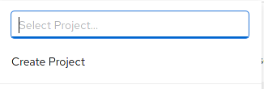
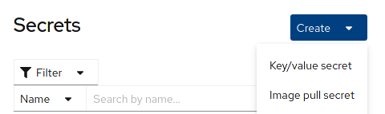
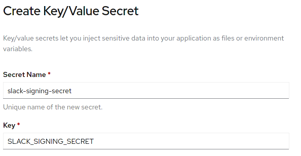
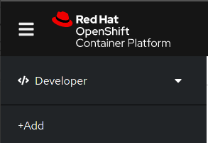
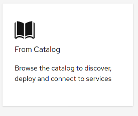
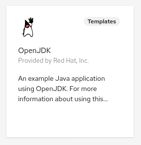
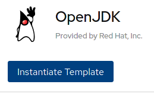
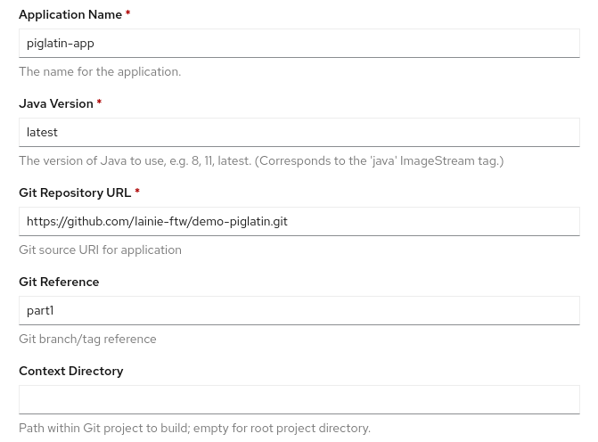
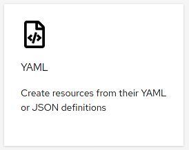
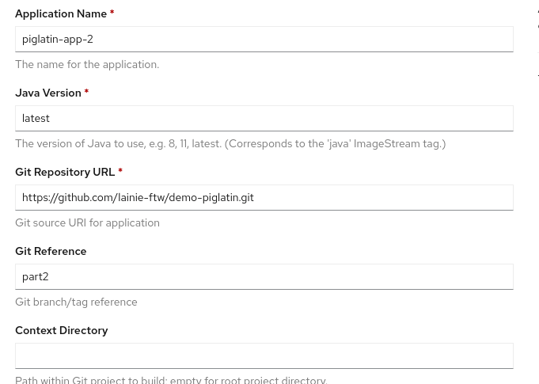

# Knative Demo on Openshift

## Prerequisites

If you are standing up a cluster yourself [click here](prerequisites.md)

Otherwise continue to labs.

## Labs

The following labs are iterative and must be done in order as each lab builds on the exercise done in the previous one.

The tools we will be using are:

* Slack
* Quarkus
* Red Hat OpenShift
* OpenShift Serverless

### Deploy Java Application

1. Make a project - user[x]-piglatin (top of console)

    

2. Apply the Slack signing secret to the project via the `secret` option int he main menu on the left then click `create` and select `Key/Value` in top right corner:

    

3. Fill with the following:

    ```shell
    Name: slack-signing-secret
    Key: SLACK_SIGNING_SECRET
    Value: will provide!
    ```

    Example:

    

4. Deploy the application from Developer View, Click `+Add:`

    

5. Click `From Catalog:`

    

6. Choose `OpenJDK template:`

    

7. Click `Instantiate Template:`

    

8. Fill out the form and click `create` when fields are filled:

    ```shell
    Application Name: piglatin-app
    Java Version: latest
    Git Repository URL:
    Git Reference: part1
    ```

    Example:

    

    `NOTE:` The template will build and deploy the application for you, creating and connecting the necessary components.

9. Test it in slack with `/piglatin phrase`

10. You can also test the endpoint with curl (update `<clusteraddress>` to your cluster):

   ```shell
   curl -X POST -d 'text=hello' http://pl-serverless-user[x]-piglatin.apps.<clusteraddress>/events
   ```

11. If you would like to force scaling you can use the [hey binary](https://github.com/rakyll/hey) (make sure to change the user and `<clusteraddress>`):

    ```shell
    hey -z 30s -c 5 -d 'text=hello' http://pl-serverless-user[x]-piglatin.apps.<clusteraddress>/events
    ```

### Part 1 but Serverless-ly

1. Apply the following yaml to your project (or use oc apply -f kvscs/pl-serverless.yaml):

    Click `+Add:`

    

    Click `YAML:`

    

    Paste below into the window (make sure to change `userx` to your user number):

    ```yaml
    apiVersion: serving.knative.dev/v1
    kind: Service
    metadata:
    name: pl-serverless
    namespace: userx-piglatin
    spec:
    template:
        spec:
        containers:
            - image: image-registry.openshift-image-registry.svc:5000/userx-piglatin/demo-piglatin:latest
            env:
                - name: SLACK_SIGNING_SECRET
                valueFrom:
                    secretKeyRef:
                    name: slack-signing-secret
                    key: SLACK_SIGNING_SECRET
    ```

### Part 2 Streaming and Messaging

We’re going to take the same Pig Latin Translator as the last session, and expand on it.
It will still run in a container, serverless-ly, and still be invoked via Slack command or API.
In addition, we’re going to send all inputs to a Kafka topic…
...and output that stream to an “admin” channel in Slack.

We will need to add a few more tools in addition to the ones we used before:

* AMQ Streams (Kafka)
* Fuse Online

1. Deploy the application from Developer View, Click `+Add:`

    

2. Click `From Catalog:`

    

3. Choose `OpenJDK template:`

    

4. Click `Instantiate Template:`

    

5. Fill out the form and click `create` when fields are filled:

    ```shell
    Application Name: piglatin-app-2
    Java Version: latest
    Git Repository URL:
    Git Reference: part2
    ```

    Example:

    

6. Apply the following yaml to your project (or use oc apply -f kvscs/pl-serverless.yaml):

    Click `+Add:`

    

    Click `YAML:`

    

    Paste below into the window (make sure to change `userx` to your user number):

    ```yaml
    apiVersion: serving.knative.dev/v1
    kind: Service
    metadata:
    name: pl-serverless
    namespace: userx-piglatin
    spec:
    template:
        spec:
        containers:
            - image: image-registry.openshift-image-registry.svc:5000/userx-piglatin/demo-piglatin:latest
            env:
                - name: SLACK_SIGNING_SECRET
                valueFrom:
                    secretKeyRef:
                    name: slack-signing-secret
                    key: SLACK_SIGNING_SECRET
    ```

7. Test it!

* Updates in Slack App
* /piglatin translate GO
* Check a Kafka pod, or the admin Slack channel to see the message log:
  * bin/kafka-console-consumer.sh --bootstrap-server cluster-kafka-bootstrap.amq-streams.svc:9092 --topic slack --from-beginning
